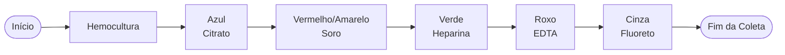
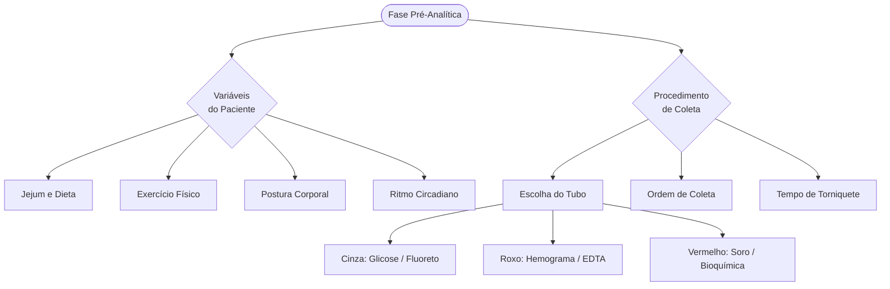

# A Fase Pré-Analítica e Instrumentação Básica

A **Bioquímica Clínica** é a ciência que utiliza métodos químicos e bioquímicos para analisar fluidos corporais, auxiliando no diagnóstico, prognóstico e monitoramento de doenças. Para que um resultado laboratorial seja confiável, o processo deve ser impecável desde o primeiro momento — muito antes de qualquer equipamento entrar em cena. Compreender a fase pré-analítica é, portanto, o alicerce de toda a prática em análises clínicas.

::: conceito
A **fase pré-analítica** engloba todas as etapas que antecedem a análise propriamente dita: a solicitação do exame, a preparação do paciente, a coleta da amostra, o transporte e o acondicionamento do material. Estudos estimam que essa fase é responsável por aproximadamente **70% dos erros** ocorridos em laboratórios clínicos.
:::

## A Importância da Fase Pré-Analítica

O resultado de um exame reflete diretamente a qualidade da amostra recebida. Um equipamento de última geração não tem como corrigir uma amostra hemolisada, coletada no tubo errado ou sem o jejum adequado. Por esse motivo, o técnico de laboratório precisa dominar cada variável que antecede a análise.

A fase pré-analítica pode ser dividida em duas grandes categorias de interferentes: as **variáveis do procedimento de coleta** (escolha do tubo, ordem de punção, tempo de torniquete) e as **variáveis biológicas do paciente** (jejum, postura, exercício físico e ritmo circadiano). O domínio dessas duas categorias é o que diferencia um profissional técnico de um profissional tecnicamente excelente.

::: atencao
Um erro na coleta — como usar o tubo errado ou demorar para separar o soro — não pode ser corrigido pelo equipamento mais moderno do mundo. **A qualidade do laudo começa na veia do paciente.**
:::

## Tipos de Amostras: Soro e Plasma

Uma das dúvidas mais comuns no início da prática laboratorial é a diferença entre soro e plasma. Ambos representam a fração líquida do sangue, mas possuem composições distintas dependendo da forma como a coleta foi realizada.

### Plasma

O plasma é a porção líquida do sangue obtida quando a coleta é feita com **anticoagulante**. Como o sangue não coagula, os fatores de coagulação — incluindo o **fibrinogênio** — permanecem intactos e dissolvidos na amostra, junto com água, proteínas, minerais e vitaminas.

O fluxo de obtenção é: coleta com aditivo (ex: Heparina, EDTA) → centrifugação → o sobrenadante é o **plasma**.

### Soro

O soro é a fração líquida obtida após a coagulação total do sangue. Quando coletamos sangue sem anticoagulante (ou com ativador de coágulo), o fibrinogênio é consumido para formar a rede de fibrina — o coágulo. Portanto, o soro é essencialmente o plasma **sem fibrinogênio** e sem os fatores de coagulação consumidos no processo.

O fluxo de obtenção é: coleta sem anticoagulante → repouso para formação do coágulo → centrifugação → o sobrenadante é o **soro**.

::: dica
Para nunca confundir soro e plasma, lembre-se da seguinte regra: **Plasma = Líquido + Fibrinogênio** (há anticoagulante, o sangue não coagulou). **Soro = Líquido − Fibrinogênio** (sem anticoagulante, o coágulo consumiu o fibrinogênio).
:::

<!-- IMAGEM: Tubo de ensaio com sangue centrifugado mostrando a separação entre soro e plasma -->

## Tubos de Coleta e Ordem de Punção

Para garantir a integridade da amostra e evitar contaminação cruzada entre os aditivos dos tubos, existe uma padronização internacional de cores e uma **ordem específica de coleta** (ordem de punção). O não cumprimento dessa sequência é uma das causas mais frequentes de resultados falsamente alterados.

### Principais Tubos, Aditivos e Indicações

| Cor da Tampa | Aditivo Principal | Mecanismo de Ação | Uso Principal |
|---|---|---|---|
| **Azul** | Citrato de Sódio | Quela o cálcio (reversível) | Coagulograma (TAP, TTPA) |
| **Vermelho/Amarelo** | Ativador de Coágulo | Acelera a coagulação (sílica/gel) | Bioquímica (soro), Sorologia |
| **Verde** | Heparina | Inibe a trombina | Bioquímica de urgência, Gasometria |
| **Roxo/Lilás** | EDTA | Quela o cálcio (irreversível) | Hematologia (Hemograma) |
| **Cinza** | Fluoreto de Sódio + EDTA | Inibe a enolase (glicólise) | **Glicose**, Lactato |

### O Tubo Cinza e a Dosagem de Glicemia

Para a dosagem de glicemia, o tubo de tampa cinza é indispensável. O **Fluoreto de Sódio** atua como inibidor da enzima **enolase** na via glicolítica. Sem esse inibidor, as hemácias e leucócitos presentes na amostra continuariam consumindo a glicose após a coleta, reduzindo falsamente o resultado. O EDTA é adicionado ao mesmo tubo para garantir a anticoagulação e manter as células em suspensão.

::: exemplo
Um paciente em jejum tem glicemia coletada às 7h da manhã. Se o tubo cinza demorar para ser centrifugado ou se a coleta for feita em tubo errado (sem fluoreto), as células do sangue consomem a glicose e o resultado pode indicar falsa **hipoglicemia** — levando a condutas clínicas incorretas.
:::

### A Ordem Correta de Coleta

Se um tubo com EDTA (roxo) for coletado antes de um tubo de bioquímica (verde ou vermelho), o potássio e o EDTA presentes na agulha podem contaminar a amostra seguinte, elevando falsamente o resultado de potássio e quelando o cálcio e o ferro. A sequência padronizada para coleta a vácuo é:

1. Hemocultura (frascos estéreis)
2. Citrato de Sódio (azul)
3. Soro — com ou sem gel (vermelho/amarelo)
4. Heparina (verde)
5. EDTA (roxo/lilás)
6. Fluoreto de Sódio (cinza)

::: atencao
A ordem de coleta **não é arbitrária**. Inverter o tubo roxo (EDTA) com o verde (Heparina), por exemplo, pode elevar falsamente o potássio sérico do paciente — erro que pode simular uma hipercalemia e levar a condutas clínicas desnecessárias.
:::

## Variáveis Biológicas do Paciente

Além dos erros técnicos de coleta, o estado fisiológico do paciente altera significativamente os analitos bioquímicos. Essas são as chamadas **variáveis pré-analíticas biológicas**, e o profissional deve orientar o paciente antes mesmo de ele chegar ao laboratório.

### Jejum e Lipemia

A ingestão de alimentos altera a turbidez do soro em decorrência da elevação de triglicérides — fenômeno denominado **lipemia**. O soro lipêmico apresenta coloração branca-leitosa e interfere nas leituras espectrofotométricas, prejudicando a dosagem de glicose, enzimas e outros analitos. Para a glicemia, exige-se jejum de no mínimo **8 horas**; para o perfil lipídico completo, o ideal são **12 horas** de jejum.

### Postura Corporal

A mudança rápida da posição supina (deitada) para a posição ereta provoca deslocamento de fluidos do espaço intravascular para o interstício. Isso concentra as moléculas que não atravessam a parede do vaso, como proteínas, lipídios e células. O resultado é um aumento de **10% a 20%** nos valores de proteínas totais, albumina, hemoglobina, cálcio e lipídios. A recomendação é que o paciente permaneça **sentado por 15 a 20 minutos** antes da coleta para estabilização hemodinâmica.

### Exercício Físico

A atividade física intensa provoca consumo energético e dano muscular transitório, liberando enzimas intracelulares para a corrente sanguínea. As principais alterações observadas são elevação de **CK (Creatinoquinase)**, LDH (Lactato Desidrogenase) e AST, além de aumento do lactato sérico pelo metabolismo anaeróbico. A orientação padrão é evitar exercícios extenuantes nas **24 horas anteriores** à coleta.

### Ritmo Circadiano

Alguns analitos flutuam naturalmente ao longo do dia em resposta ao ciclo hormonal — variação denominada **cronobiológica**. O **cortisol** e o **ferro sérico**, por exemplo, apresentam picos pela manhã e quedas progressivas à tarde. Por essa razão, a padronização do horário de coleta é fundamental para a comparação de resultados entre exames diferentes do mesmo paciente.

::: dica
Crie o hábito de checar quatro variáveis biológicas antes de qualquer coleta: **J**ejum, **P**ostura, **E**xercício e **R**itmo circadiano — o mnemônico **JPER** ajuda a lembrar os principais interferentes do paciente.
:::

## Mapa Conceitual e Fixação

### Visão Geral da Fase Pré-Analítica

### Convite à Reflexão

::: dica
Imagine que um familiar seu foi fazer exames de rotina. O laboratório orientou apenas: "venha em jejum de 8 horas". Nada mais. Ele, como de costume, acordou cedo, foi à academia e treinou pesado antes de ir à coleta — afinal, ninguém disse que não podia. Nenhum profissional perguntou sobre o exercício ou qualquer outra variável. O sangue foi coletado, o resultado saiu e o médico interpretou aqueles números como se fossem o retrato fiel da saúde do seu familiar. Será que eram? Reflita sobre o seu papel como futuro técnico em Análises Clínicas: o que você faria de diferente nesse atendimento?
:::

::: referencias
ANDRIOLO, A. et al. *Recomendações da Sociedade Brasileira de Patologia Clínica/Medicina Laboratorial (SBPC/ML): Coleta e Preparo da Amostra Biológica*. 1. ed. São Paulo: Manole, 2013.

LAVIERI, G. *Interpretação de Exames em Bioquímica Clínica*. E-book Farmaceuticando.

FUNDAÇÃO DE EDUCAÇÃO PARA O TRABALHO DE MINAS GERAIS. *Curso Técnico em Análises Clínicas — Etapa 1: Fundamentos em Análises Clínicas*.

MOTTA, V. T. *Bioquímica Clínica para o Laboratório: Princípios e Interpretações*. 5. ed. Rio de Janeiro: Medbook, 2009.
:::
