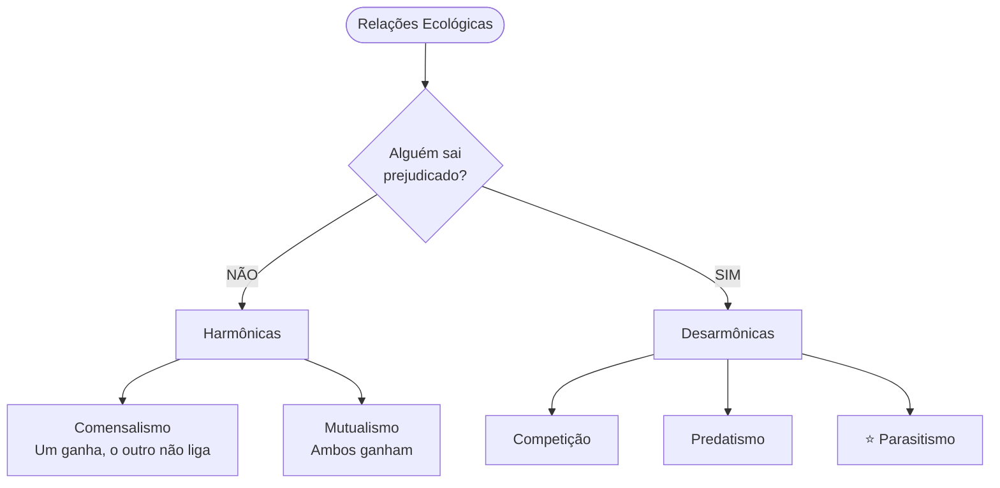
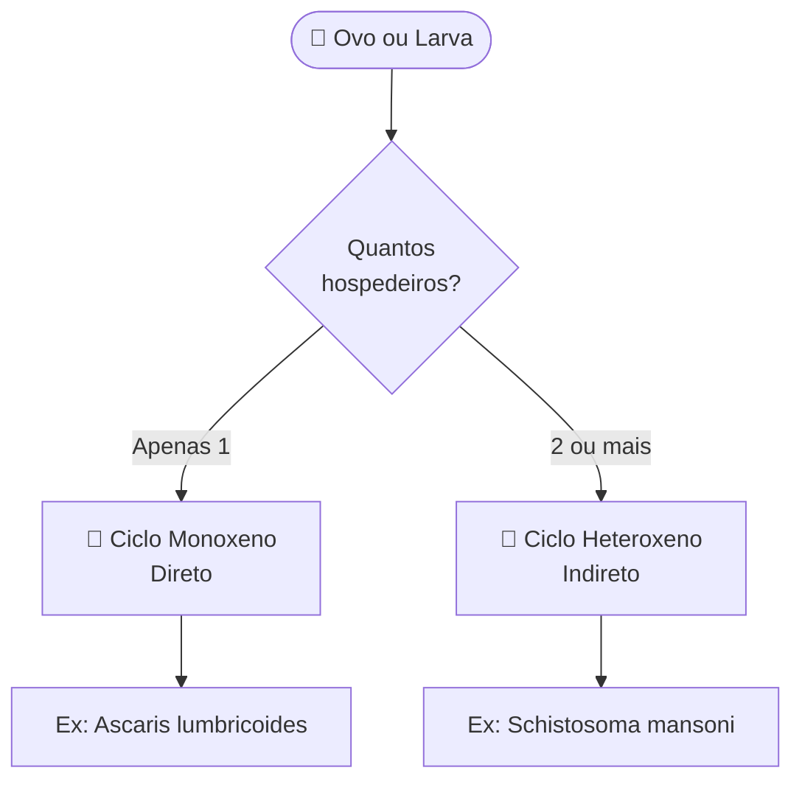

# O que é Parasitologia?

A **Parasitologia** é a ciência que estuda os **parasitos**: seres que vivem associados a
outros seres vivos (hospedeiros) para conseguir alimento e abrigo.

Para entender isso, precisamos definir o **Parasitismo**.

::: conceito
É uma relação onde existe uma **"via de mão única"** nos benefícios.
O parasita depende metabolicamente do hospedeiro para sobreviver,
enquanto o hospedeiro sofre prejuízo contínuo.
:::

---

## Relações Ecológicas: Como os seres convivem?

Na natureza, os animais e microrganismos interagem de várias formas.
Podemos organizar essas interações em um esquema lógico:

### 2.1. Relações Harmônicas (Positivas)

- **Comensalismo:** É a relação de "comer na mesma mesa". Uma espécie se beneficia,
  e para a outra tanto faz.
  - Exemplo: *Entamoeba coli* no intestino humano (não causa doença).
- **Mutualismo:** É uma troca de favores onde ambos ganham. Pode ser tão forte que
  eles não conseguem viver separados (simbiose).
  - Exemplo: Protozoários no estômago do cupim digerindo a madeira.

### 2.2. Relações Desarmônicas (Negativas)

- **Parasitismo:** O foco do nosso curso. O parasita vive às custas do hospedeiro,
  causando doenças, mas geralmente tenta não matar o hospedeiro rapidamente
  para não perder sua "casa".

---

## Classificação dos Ciclos e Hospedeiros

Para diagnosticar uma doença, o técnico precisa saber como o parasita
viaja de uma pessoa para outra. Isso depende do número de hospedeiros que ele precisa.

### 3.1. Tipos de Ciclo Biológico

### 3.2. Quem é quem no Ciclo Indireto?

Quando o ciclo é indireto (Heteroxeno), temos dois tipos principais de hospedeiros:

1. **Hospedeiro Definitivo (HD):** Onde vive o parasita **ADULTO** ou onde ocorre
   a reprodução **SEXUADA**.
2. **Hospedeiro Intermediário (HI):** Onde vive o parasita **LARVA** ou onde ocorre
   a reprodução **ASSEXUADA**.

::: dica
Existe ainda o **Hospedeiro Paratênico (Transporte)**. O parasita entra nele,
mas não evolui. Fica "dormindo" (encistado) esperando que o hospedeiro definitivo
coma esse animal.
:::

---

## Vetores: Os Entregadores de Doenças

Muitas doenças precisam de um inseto para levar o parasita até o hospedeiro.

- **Vetor Biológico:** O parasita **evolui e se multiplica** dentro do inseto.
  É parte essencial do ciclo. *Ex: Mosquito Anopheles na Malária.*
- **Vetor Mecânico:** Apenas **transporta** o parasita nas patas ou corpo.
  Não é essencial ao ciclo. *Ex: Mosca doméstica e barata.*

::: atencao
Não confunda **vetor biológico** com **hospedeiro intermediário**. O vetor
*transporta* o parasita; o HI *hospeda* uma fase do desenvolvimento dele.
:::

---

## Como o Parasita agride o organismo? (Ação Patogênica)

O parasita não está lá apenas ocupando espaço. Ele causa danos de quatro formas:

| Ação Patogênica  | Mecanismo                        | Exemplo clínico                   |
|------------------|----------------------------------|-----------------------------------|
| 🩸 Espoliativa   | Rouba nutrientes do hospedeiro   | Anemia por ancilostomídeo         |
| 🔒 Mecânica      | Ocupa espaço / obstrui estruturas | Bolo de *Ascaris* no intestino   |
| 🔪 Traumática    | Lesiona tecidos ao migrar        | Larva migrando pelo pulmão        |
| ☠️ Tóxica        | Libera toxinas e metabólitos     | Reação alérgica a antígenos       |

::: exemplo
Um paciente com ancilostomíase apresenta **anemia ferropriva** porque o parasita
se fixa na mucosa intestinal e suga sangue continuamente — ação **espoliativa**.
Ao mesmo tempo, a fixação causa microlesões na mucosa — ação **traumática**.
O mesmo parasita pode exercer mais de uma ação patogênica simultaneamente.
:::

::: referencias
NEVES, D. P. *Parasitologia Humana*. São Paulo: Atheneu, 2016.

REY, L. *Bases da Parasitologia Médica*. Rio de Janeiro: Guanabara Koogan, 2010.
:::
