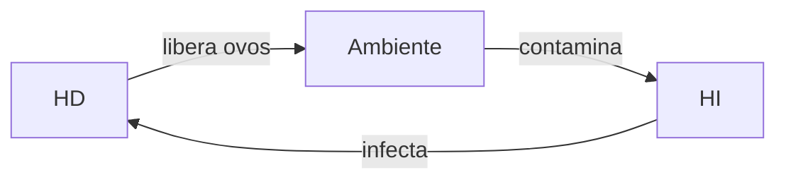

# MKD-Project — CETEP-LNAB
**Pipeline de publicação de materiais didáticos: Markdown → HTML → PDF**

Converte arquivos `.md` escritos no MarkText em documentos HTML estilizados
(tema livro didático) e PDF de alta qualidade, sem dependências de IA,
sem servidor e sem ferramentas pagas.

---

## Sumário

1. [Visão geral](#visão-geral)
2. [Requisitos e instalação — Windows](#requisitos-e-instalação--windows)
3. [Requisitos e instalação — Linux/Debian](#requisitos-e-instalação--linuxdebian)
4. [Estrutura do projeto](#estrutura-do-projeto)
5. [Fluxo de trabalho diário](#fluxo-de-trabalho-diário)
6. [Front matter YAML](#front-matter-yaml)
7. [Marcadores de estilo no Markdown](#marcadores-de-estilo-no-markdown)
8. [Imagens](#imagens)
9. [Diagramas Mermaid](#diagramas-mermaid)
10. [Ajuste de margens no PDF](#ajuste-de-margens-no-pdf)
11. [Solução de problemas](#solução-de-problemas)

---

## Visão geral

```
documento.md
    │
    ▼
[Pandoc + cetep.html]       ← template injeta cabeçalho, CSS, Mermaid.js
    │
    ▼
saida/documento.html
    │
    ▼
[Playwright + Chromium]     ← abre HTML, aguarda Mermaid renderizar, imprime
    │
    ▼
saida/documento.pdf
```

O script `gerar-pdf.py` executa os dois passos automaticamente com um único comando.

> **Importante:** o HTML incorpora todo o CSS do `cetep.html` no momento em que
> o Pandoc roda. Se você substituir o `cetep.html`, sempre regenere o HTML
> executando o script novamente — nunca reutilize um HTML gerado com a versão antiga.

---

## Requisitos e instalação — Windows

### Ferramentas necessárias

| Ferramenta | Função | Versão mínima |
|------------|--------|---------------|
| Python | Executa o script de automação | 3.11+ |
| Pandoc | Converte `.md` em HTML | 3.0+ |
| Playwright | Gera PDF via Chromium headless | 1.40+ |
| Chromium | Renderizador do PDF | qualquer |

### 1. Instalar o Chocolatey (gerenciador de pacotes)

O Chocolatey é o gerenciador de pacotes recomendado para Windows.
Abra o PowerShell como **Administrador** e execute:

```powershell
Set-ExecutionPolicy Bypass -Scope Process -Force
[System.Net.ServicePointManager]::SecurityProtocol = [System.Net.ServicePointManager]::SecurityProtocol -bor 3072
iex ((New-Object System.Net.WebClient).DownloadString('https://community.chocolatey.org/install.ps1'))
```

Verifique:
```powershell
choco --version
```

### 2. Instalar o Pandoc via Chocolatey

```powershell
choco install pandoc -y
```

Recarregue o PATH após a instalação:
```powershell
Import-Module $env:ChocolateyInstall\helpers\chocolateyProfile.psm1
refreshenv
```

Verifique:
```powershell
pandoc --version
```

### 3. Instalar o Python

Baixe em <https://python.org/downloads> e instale marcando a opção
**"Add Python to PATH"** durante a instalação.

Verifique:
```powershell
python --version
```

### 4. Instalar o Playwright e o Chromium

```powershell
python -m pip install playwright
python -m playwright install chromium
```

> **Nota:** O download do Chromium tem cerca de 170 MB. Se a conexão
> for lenta, baixe manualmente o `chrome-win64.zip` em
> <https://playwright.dev> e extraia em
> `C:\Users\SEU_USUARIO\AppData\Local\ms-playwright\chromium-1208\chrome-win64\`

---

## Requisitos e instalação — Linux/Debian

O pipeline funciona em servidores Debian/Ubuntu **sem desktop** — o Chromium
opera em modo headless e não exige ambiente gráfico.

### Distribuições baseadas em Debian/Ubuntu

```bash
# Pandoc
sudo apt update && sudo apt install pandoc -y

# Python e pip (geralmente já instalados)
sudo apt install python3 python3-pip -y

# Playwright
pip3 install playwright --break-system-packages
python3 -m playwright install chromium
python3 -m playwright install-deps chromium
```

O comando `install-deps` instala as bibliotecas de sistema necessárias para o
Chromium headless (`libnss3`, `libatk1.0-0`, `libgbm1` etc.). Se não tiver
acesso root, instale-as manualmente:

```bash
sudo apt-get install -y libnss3 libnspr4 libatk1.0-0 libatk-bridge2.0-0 \
  libcups2 libdrm2 libxkbcommon0 libxcomposite1 libxdamage1 libxfixes3 \
  libxrandr2 libgbm1 libasound2
```

> **Containers e VPS restritos:** se o Chromium falhar com erro de sandbox,
> adicione `args=["--no-sandbox"]` ao `p.chromium.launch()` no `gerar-pdf.py`.

### Distribuições baseadas em Arch

```bash
sudo pacman -S pandoc python python-pip
pip install playwright
playwright install chromium
playwright install-deps chromium
```

### Verificar instalação

```bash
pandoc --version
python3 --version
python3 -m playwright --version
```

---

## Estrutura do projeto

```
MKD-Project/
├── cetep.html          ← template Pandoc (moldura visual do documento)
├── gerar-pdf.py        ← script de automação
├── README.md           ← este arquivo
│
├── documentos/         ← seus arquivos .md ficam aqui
│   ├── modelo.md
│   ├── Cap01-Parasitologia.md
│   └── Cap02-Protozoarios.md
│
└── saida/              ← HTMLs e PDFs gerados automaticamente
    ├── Cap01-Parasitologia.html
    ├── Cap01-Parasitologia.pdf
    └── ...
```

> O `cetep.html` é o template — define a aparência visual.
> Nunca edite-o para mudar conteúdo; apenas para ajustar o design.

---

## Fluxo de trabalho diário

### Passo 1 — Escreva no MarkText

Abra ou crie um `.md` na pasta `documentos/`.
Todo arquivo deve começar com o bloco YAML (ver seção [Front matter YAML](#front-matter-yaml)).

### Passo 2 — Gere o documento

**Windows (PowerShell):**
```powershell
cd "C:\Users\SEU_USUARIO\OneDrive\MKD-Project\documentos"
python ..\gerar-pdf.py NomeDoDocumento.md
```

**Linux (Terminal):**
```bash
cd ~/MKD-Project/documentos
python3 ../gerar-pdf.py NomeDoDocumento.md
```

**Linux — servidor sem desktop (use sempre `--nao-abrir`):**
```bash
python3 ../gerar-pdf.py NomeDoDocumento.md --nao-abrir
```

### Passo 3 — Resultado esperado

```
→ Etapa 1/2 — Pandoc: Cap01-Parasitologia.md
✓ HTML gerado: .../saida/Cap01-Parasitologia.html  (48.3 KB)
→ Etapa 2/2 — Playwright: gerando PDF...
✓ PDF gerado:  .../saida/Cap01-Parasitologia.pdf  (312.1 KB)
✓ Concluído!
```

### Gerar apenas o HTML (visualização rápida)

```bash
# Windows
pandoc documento.md --template=..\cetep.html --standalone -o ..\saida\documento.html

# Linux
pandoc documento.md --template=../cetep.html --standalone -o ../saida/documento.html
```

Abra o HTML no Chrome ou Edge. Os diagramas Mermaid renderizam no browser.
Use `Ctrl+P` para imprimir manualmente se preferir não usar o script.

---

## Front matter YAML

Todo arquivo `.md` deve começar com um bloco YAML entre `---`.
Ele define as variáveis que preenchem o cabeçalho institucional.

```markdown
---
turma: 1TACM1-M2
disciplina: Parasitologia
professor: Lucas Batista
capitulo: "1"
titulo: "O que é Parasitologia?"
unidade: Unidade 1
ano: "2025"
---
```

### Variáveis disponíveis

| Variável | Obrigatória | Onde aparece | Exemplo |
|----------|:-----------:|--------------|---------|
| `turma` | Sim | Cabeçalho | `1TACM1-M2` |
| `disciplina` | Sim | Cabeçalho e rodapé | `Parasitologia` |
| `professor` | Sim | Cabeçalho e rodapé | `Lucas Batista` |
| `capitulo` | Não¹ | Badge azul no topo | `"1"` |
| `apontamento` | Não¹ | Badge índigo no topo | `"Resumo"` |
| `titulo` | Sim | Título da aba do browser | `"O que é Parasitologia?"` |
| `subtitulo` | Não | Subtítulo abaixo do título | `"Conceitos e classificação"` |
| `unidade` | Não | Rodapé | `Unidade 1` |
| `ano` | Não | Cabeçalho e rodapé | `"2025"` |

> ¹ Use **ou** `capitulo` **ou** `apontamento` — nunca os dois no mesmo documento.
> `capitulo` gera um badge azul numerado; `apontamento` gera um badge índigo com
> ícone 📝 e texto livre (ex.: `"Resumo"`, `"Lista 01"`, `"Ficha de Revisão"`).

> **Dica:** valores numéricos como `capitulo` e `ano` devem ficar
> entre aspas (`"1"`) para o Pandoc tratá-los como texto.

---

## Marcadores de estilo no Markdown

O template reconhece marcadores especiais que transformam blocos de texto
em componentes visuais estilizados. Todos usam a sintaxe de
**fenced divs** do Pandoc (blocos `:::`).

> **Atenção no MarkText:** os blocos `:::` não são renderizados
> visualmente no editor — aparecem como texto puro. O estilo só é
> aplicado no HTML/PDF gerado pelo Pandoc. Isso é comportamento normal.

---

### `::: conceito` — Box Conceito-chave

**Quando usar:** definições formais, conceitos centrais do conteúdo.

**Visual:** fundo azul claro · barra lateral azul · rótulo CONCEITO-CHAVE

```markdown
::: conceito
**Parasitismo** é uma relação ecológica desarmônica onde o parasita
obtém benefício às custas do hospedeiro, causando-lhe prejuízo contínuo.
:::
```

---

### `::: dica` — Box Dica de Ouro

**Quando usar:** dicas práticas, macetes de memorização, observações pedagógicas.

**Visual:** fundo amarelo · barra lateral laranja · ★ · rótulo DICA DE OURO

```markdown
::: dica
Para lembrar: o Hospedeiro **D**efinitivo tem o parasita **D**esenvolvido
(adulto). O **I**ntermediário tem a fase **I**nfantil (larva).
:::
```

---

### `::: atencao` — Box Atenção

**Quando usar:** alertas, erros conceituais comuns, pontos críticos de prova.

**Visual:** fundo vermelho suave · barra lateral vermelha · ! · rótulo ATENÇÃO

```markdown
::: atencao
Não confunda **vetor biológico** com **hospedeiro intermediário**.
O vetor transporta o parasita; o HI hospeda uma fase do ciclo biológico.
:::
```

---

### `::: exemplo` — Box Exemplo Prático

**Quando usar:** casos clínicos, exemplos do mundo real, aplicações práticas.

**Visual:** fundo verde claro · barra lateral verde · Ex · rótulo EXEMPLO PRÁTICO

```markdown
::: exemplo
Paciente com ancilostomíase apresenta anemia ferropriva porque o parasita
se fixa na mucosa intestinal e suga sangue continuamente — ação espoliativa.
:::
```

---

### `::: reflexao` — Box Convite à Reflexão

**Quando usar:** questões abertas, cenários para debate, provocações pedagógicas
que exigem resposta elaborada do aluno.

**Visual:** fundo roxo pastel · borda tracejada roxa em todos os lados ·
ícone ✶ em círculo · rótulo CONVITE À REFLEXÃO · separador tracejado entre parágrafos

```markdown
::: reflexao
Imagine que um familiar foi fazer exames e treinou pesado antes da coleta,
sem que ninguém o orientasse. O resultado reflete fielmente a saúde dele?

Reflita sobre o seu papel como futuro técnico: o que você faria diferente
nesse atendimento?
:::
```

> Aceita múltiplos parágrafos. Cada parágrafo recebe uma linha divisória
> tracejada roxa entre eles — efeito visual de "caderno de anotações".

---

### `::: saibamais` — Box Saiba Mais

**Quando usar:** aprofundamentos opcionais, curiosidades, contexto histórico
ou científico extra que não é obrigatório para a avaliação.

**Visual:** fundo teal pastel · barra lateral teal · + · rótulo SAIBA MAIS

```markdown
::: saibamais
O termo "parasito" deriva do grego *parasitos* — aquele que come
na mesa de outro. O conceito foi formalizado na Biologia no século XIX.
:::
```

---

### `::: exercicios` — Box Exercícios de Fixação

**Quando usar:** questões, atividades práticas, avaliações formativas,
listas de exercícios incorporadas ao material didático.

**Visual:** fundo âmbar pastel · barra lateral âmbar · ✎ · rótulo EXERCÍCIOS DE FIXAÇÃO

```markdown
::: exercicios
1. Diferencie hospedeiro definitivo de hospedeiro intermediário.
2. Cite dois exemplos de vetores biológicos e as doenças que transmitem.
3. O que é ação patogênica espoliativa? Dê um exemplo clínico.
:::
```

---

### `::: leitura` — Box Leitura Recomendada

**Quando usar:** indicações bibliográficas extras, sugestões de aprofundamento,
capítulos específicos de livros ou artigos complementares.

**Visual:** fundo rosa pastel · barra lateral rosa · 📖 · rótulo LEITURA RECOMENDADA

```markdown
::: leitura
NEVES, D. P. *Parasitologia Humana*. São Paulo: Atheneu, 2016.
Capítulos 1 e 2 — Introdução e Classificação dos Parasitos.
:::
```

---

### `::: referencias` — Box Bibliografia

**Quando usar:** ao final do documento para listar todas as fontes consultadas.

**Visual:** fundo cinza · rótulo BIBLIOGRAFIA CONSULTADA

```markdown
::: referencias
NEVES, D. P. *Parasitologia Humana*. São Paulo: Atheneu, 2016.

REY, L. *Bases da Parasitologia Médica*. Rio de Janeiro: Guanabara Koogan, 2010.
:::
```

---

### `>` — Blockquote genérico

**Quando usar:** destaques rápidos sem categoria específica.

**Visual:** fundo amarelo suave · barra lateral laranja (mesmo estilo do `::: dica`)

```markdown
> A Parasitologia é a base de toda a área de Análises Clínicas.
```

---

### Formatação inline padrão do Markdown

Funciona normalmente dentro de qualquer bloco:

```markdown
**negrito**          → destaque em azul institucional
*itálico*            → texto em itálico cinza
`código inline`      → trecho de código em azul
[link](https://...)  → hiperlink azul sublinhado
```

### Tabela de referência rápida

| Marcador | Cor | Rótulo | Uso indicado |
|----------|-----|--------|--------------|
| `::: conceito` | Azul | CONCEITO-CHAVE | Definições formais |
| `::: dica` | Laranja/Amarelo | DICA DE OURO | Macetes pedagógicos |
| `::: atencao` | Vermelho | ATENÇÃO | Alertas e erros comuns |
| `::: exemplo` | Verde | EXEMPLO PRÁTICO | Casos clínicos |
| `::: reflexao` | Roxo | CONVITE À REFLEXÃO | Questões abertas para debate |
| `::: saibamais` | Teal | SAIBA MAIS | Aprofundamentos opcionais |
| `::: exercicios` | Âmbar | EXERCÍCIOS DE FIXAÇÃO | Questões e atividades |
| `::: leitura` | Rosa | LEITURA RECOMENDADA | Indicações bibliográficas |
| `::: referencias` | Cinza | BIBLIOGRAFIA | Fontes ao final |
| `> texto` | Laranja | — | Destaque rápido genérico |

---

## Imagens

### Sintaxe básica com legenda

```markdown

```

### Controle de tamanho

```markdown
{width=100px}
{width=250px}
{width=400px}
```

### Imagem centralizada com legenda formal

```markdown
<figure>
  
  <figcaption>Figura 1 — Descrição detalhada da imagem.</figcaption>
</figure>
```

### Imagens dentro de tabela

```markdown
| Organismo | Imagem | Classificação |
|-----------|--------|---------------|
| Ascaris | {width=100px} | Helminto nematódeo |
| Giardia | {width=100px} | Protozoário flagelado |
```

### URLs do GitHub

Sempre use a URL **raw**, não a URL da página do repositório:

```
❌  https://github.com/usuario/repo/blob/main/imagem.png
✓   https://raw.githubusercontent.com/usuario/repo/main/imagem.png
```

### Imagens locais

Salve em `documentos/imagens/` e use caminho relativo:

```markdown
{width=400px}
```

---

## Diagramas Mermaid

O template inclui o Mermaid.js, que renderiza automaticamente
blocos de código marcados como `mermaid`.

### Fluxograma vertical

````markdown

````

### Fluxograma horizontal

````markdown

````

### Outros tipos suportados

| Tipo | Palavra-chave |
|------|---------------|
| Diagrama de sequência | `sequenceDiagram` |
| Diagrama de classe UML | `classDiagram` |
| Gráfico de pizza | `pie` |
| Linha do tempo | `timeline` |

> O MarkText renderiza os blocos Mermaid em tempo real no editor.
> Se um diagrama aparecer com "Syntax error" no PDF, revise a sintaxe —
> palavras reservadas como `end` e `if` não podem ser usadas como rótulos
> de nós sem estar entre aspas.

---

## Ajuste de margens no PDF

As margens do PDF são controladas **exclusivamente pelo CSS** dentro do `cetep.html`,
no bloco `@media print`. O `gerar-pdf.py` passa `margin: "0"` ao Playwright e deixa
toda a responsabilidade de espaçamento para o template.

### Como funciona

```css
/* Trecho relevante do @media print no cetep.html */
.page {
    padding: 18mm !important;   /* ← margem de todos os lados no PDF */
}
@page {
    size: A4 portrait;
    margin: 0mm;
}
```

### Para ajustar as margens

Edite o valor de `padding` na regra `.page` dentro do bloco `@media print`
no `cetep.html`. Exemplos:

```css
/* Simétrico padrão (padrão atual) */
padding: 18mm !important;

/* Encadernação (mais espaço no topo e base) */
padding: 20mm 18mm 24mm 18mm !important;

/* Compacto (mais conteúdo por página) */
padding: 14mm 16mm 18mm 16mm !important;
```

> A notação é: `topo direita base esquerda` (sentido horário, como no CSS padrão).

### ⚠️ Atenção: possíveis problemas com margem superior e inferior

O Chromium headless tem um comportamento particular ao gerar PDFs: ele renderiza
o layout da página em **modo tela** antes de imprimir. Isso pode fazer com que
o `padding-top` e o `padding-bottom` do `.page` no `@media print` não sejam
aplicados corretamente em todas as versões do Playwright/Chromium, resultando
em margens verticais menores ou maiores do que o esperado.

**Sintomas comuns:**

- Margem superior quase zero — o cabeçalho do documento cola no topo da folha.
- Margem inferior ausente — o rodapé cola na borda inferior.
- Margem superior maior que a configurada — a barra colorida do topo do `.page`
  soma espaço adicional ao padding.

**O que fazer se as margens verticais estiverem incorretas:**

Ajuste o `padding-top` e `padding-bottom` separadamente no bloco `@media print`
do `cetep.html`, usando `!important` em cada um:

```css
@media print {
  .page {
    padding-top:    22mm !important;   /* aumente se o topo estiver colado */
    padding-bottom: 20mm !important;   /* aumente se o rodapé estiver colado */
    padding-left:   18mm !important;
    padding-right:  18mm !important;
  }
}
```

Ajuste em incrementos de 2mm, gere o PDF e meça visualmente até o resultado
ficar satisfatório. Os valores ideais podem variar conforme a versão do
Chromium instalada no sistema.

**Nota sobre margens laterais:** as margens esquerda e direita tendem a ser
mais estáveis entre versões, pois dependem diretamente do `padding` lateral
do `.page` sem interferência da barra decorativa `::before` que existe no topo.

---

## Solução de problemas

**`pandoc: command not found`**
Feche e reabra o terminal. No PowerShell com Chocolatey:
```powershell
Import-Module $env:ChocolateyInstall\helpers\chocolateyProfile.psm1
refreshenv
```

**`pip` não reconhecido no PowerShell**
Use `python -m pip` no lugar de `pip` diretamente.

**Erro de permissão ao salvar o PDF**
O arquivo PDF anterior está aberto. Feche-o e execute novamente.

**PDF gerado sem estilos (só texto simples)**
O `cetep.html` não foi encontrado. Verifique o caminho da variável
`TEMPLATE` no `gerar-pdf.py`.

**Estilos corretos no HTML mas incorretos no PDF**
O HTML foi gerado com uma versão antiga do `cetep.html`. O CSS é incorporado
no HTML no momento do Pandoc — substitua o `cetep.html` e rode o script
novamente para regenerar o HTML antes de gerar o PDF.

**Fontes não carregadas no PDF**
O Playwright precisa de internet para baixar as fontes do Google Fonts
na primeira vez. Em ambientes offline, substitua os links no `cetep.html`
por fontes locais ou fontes do sistema.

**Erro `PermissionError` com OneDrive**
O OneDrive bloqueia arquivos durante a sincronização. Defina a pasta
`saida/` fora do OneDrive alterando a variável `SAIDA_PADRAO` no `gerar-pdf.py`:
```python
SAIDA_PADRAO = Path(r"D:\CETEP-saida")
```

**Diagramas Mermaid com "Syntax error"**
Verifique: palavras reservadas (`end`, `if`, `class`) usadas como rótulos
sem aspas, aspas mal fechadas, ou indentação incorreta em subgraphs.

**Erro de sandbox no Linux/Docker**
O Chromium headless pode falhar em containers com seccomp restritivo.
Edite o `gerar-pdf.py` e adicione `args=["--no-sandbox"]` ao launch:
```python
browser = p.chromium.launch(args=["--no-sandbox"])
```

**`xdg-open: command not found` em servidor Linux**
Use sempre o parâmetro `--nao-abrir` em ambientes sem desktop:
```bash
python3 gerar-pdf.py documento.md --nao-abrir
```
